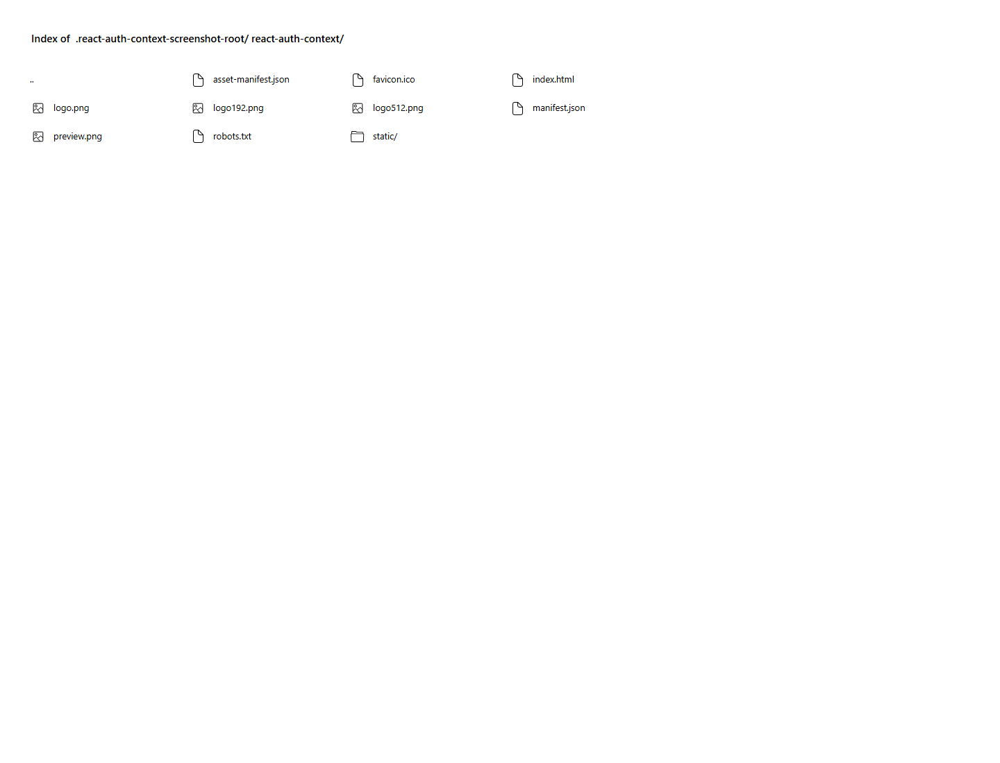

# React Auth Context

A small React authentication example that demonstrates context-based session state, protected routes and a responsive application layout.



## Features

- Context provider for login and logout state
- JSON session persistence with local storage
- Protected profile route with redirect handling
- Responsive fixed header with mobile navigation
- Icon-only social and support footer links
- Floating go-to-top control with smooth scrolling
- Clear example pages for extending the route structure

## Tech stack

React, Create React App, React Router, Material UI, Sass and React Toastify.

## Run locally

```bash
npm install
npm start
```

## Deploy

```bash
npm run deploy
```

## Links

- Portfolio: [https://www.ashishranjan.net](https://www.ashishranjan.net)
- GitHub: [https://github.com/a2rp](https://github.com/a2rp)
- CodePen: [https://codepen.io/ash1198](https://codepen.io/ash1198)
- LinkedIn: [https://www.linkedin.com/in/aashishranjan](https://www.linkedin.com/in/aashishranjan)
- Facebook: [https://www.facebook.com/theash.ashish/](https://www.facebook.com/theash.ashish/)
- YouTube: [https://www.youtube.com/@ashishranjan-ashz?sub_confirmation=1](https://www.youtube.com/@ashishranjan-ashz?sub_confirmation=1)
- Email: [ash.ranjan09@gmail.com](mailto:ash.ranjan09@gmail.com)

## Support

- Support: [https://a2rp-donation-page.netlify.app/](https://a2rp-donation-page.netlify.app/)
- Buy Me a Coffee: [https://buymeacoffee.com/a2rp](https://buymeacoffee.com/a2rp)
- Patreon: [https://patreon.com/a2rp](https://patreon.com/a2rp)
